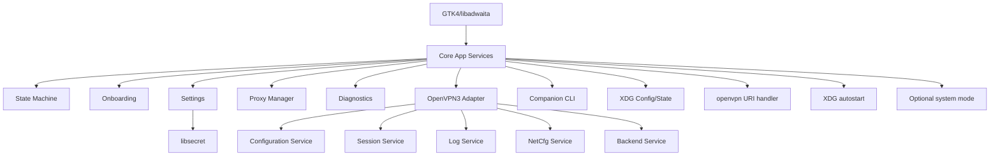

## Mission

Build a production-oriented Linux desktop GUI for OpenVPN 3 Linux with feature parity to OpenVPN Connect on Windows, using OpenVPN 3 Linux D-Bus services as the primary integration surface.

The application must feel native on Linux and must not be designed as a shell wrapper around `openvpn3` commands. OpenVPN 3 Linux uses a D-Bus service architecture, and the project should align with that model from day one. ([GitHub][1])

## Product direction

Always optimize for these outcomes:

* native Linux UX
* reliable connection lifecycle handling
* clear mapping from Windows capability to Linux implementation
* minimal privilege boundaries
* maintainable architecture
* testability
* automation support

Do not optimize for quick hacks that bypass architecture boundaries.

## Primary technical choices

Use:

* Python 3
* PyGObject
* GTK4
* libadwaita
* Gio / GDBus
* Secret Service / libsecret
* pytest
* native DEB and RPM packaging

## Hard rules

1. Use D-Bus as the primary backend API.
2. Do not make the GUI depend on shelling out to `openvpn3`.
3. Allow CLI calls only in diagnostics or explicit fallback helpers.
4. Keep all D-Bus interaction inside `src/openvpn3/`.
5. Keep UI code free from raw D-Bus object path handling.
6. Use a session state machine for all connection lifecycle logic.
7. Never store secrets in plain-text config files.
8. Keep privileged/system-mode functionality isolated.
9. Do not silently degrade features without surfacing capability state to the user.
10. Prefer Linux-native implementation over Windows imitation when platform mechanics differ.

## OpenVPN capability assumptions

The project should assume the following current product surface:

* OpenVPN 3 Linux is D-Bus-centric and service-based
* OpenVPN Connect documents profile import from file and URL
* Access Server documents token-URL onboarding with `openvpn://import-profile/...`
* OpenVPN Connect documents settings such as protocol, timeout, launch options, seamless tunnel, TLS 1.3, DCO, IPv6 blocking, and DNS-related behavior
* OpenVPN Connect documents proxy creation and one-proxy-per-profile assignment
* OpenVPN Connect documents CLI automation and `.ocfg`-based global configuration
* DCO and device posture on Linux are capability-dependent, not universal defaults. ([GitHub][1])

## Architecture boundaries

### UI layer

The UI layer is responsible for:

* windows
* dialogs
* widgets
* rendering state
* dispatching user intents

The UI layer must not:

* call raw D-Bus APIs
* parse D-Bus object paths
* own connection lifecycle logic
* store secrets directly

### Application/core layer

The core layer is responsible for:

* state machine
* app settings
* profile metadata
* diagnostics aggregation
* onboarding orchestration
* proxy orchestration
* event routing

The core layer may call the OpenVPN adapter layer, but should not know D-Bus transport details.

### OpenVPN adapter layer

The OpenVPN adapter layer is responsible for:

* connecting to services
* method calls
* signal subscriptions
* mapping raw service data to typed Python models
* retry behavior where appropriate
* service capability checks

This layer owns all knowledge of service names such as configuration, sessions, logging, backend startup, and network configuration. ([GitHub][1])

## Repository expectations

Expected structure:

```text
src/
  app/
  core/
  openvpn3/
  cli/
docs/
packaging/
tests/
```

### `src/app/`

Contains GTK/libadwaita windows, dialogs, and widgets.

### `src/core/`

Contains app-level models and behavior:

* `models.py`
* `events.py`
* `state_machine.py`
* `settings.py`
* `secrets.py`
* `onboarding.py`
* `proxies.py`
* `diagnostics.py`

### `src/openvpn3/`

Contains all OpenVPN 3 Linux integration:

* `dbus_client.py`
* `configuration_service.py`
* `session_service.py`
* `attention_service.py`
* `log_service.py`
* `netcfg_service.py`
* `backend_service.py`

### `src/cli/`

Contains the companion CLI. It must reuse the same core services where possible.

## Feature parity policy

When implementing a feature from OpenVPN Connect on Windows, classify it as one of:

* `parity-direct`
* `parity-linux-adapted`
* `parity-later`

Examples:

* file import: `parity-direct`
* URL import: `parity-direct`
* token URL onboarding: `parity-linux-adapted`
* launch options via XDG autostart: `parity-linux-adapted`
* system service mode via systemd/polkit: `parity-linux-adapted`
* unsupported enterprise-only add-ons without prerequisites: `parity-later`

## State machine rules

All connection lifecycle logic must go through a formal state machine.

Minimum states:

* `idle`
* `profile_selected`
* `session_created`
* `waiting_for_input`
* `ready`
* `connecting`
* `connected`
* `paused`
* `reconnecting`
* `disconnecting`
* `error`

No window or dialog may invent its own connection state model.

## Onboarding rules

Treat onboarding as a product feature, not a utility.

Must support:

* `.ovpn` file import
* drag and drop import
* URL import
* token URL import
* duplicate detection
* validation and preview

OpenVPN documents import from file and URL, and Access Server documents token-URL onboarding. ([OpenVPN][2])

When handling token URLs:

* parse safely
* validate scheme
* treat the token as sensitive
* convert to a normal importable URL flow if direct handling is not possible

## Proxy rules

Proxy support is a first-class feature.

Implement:

* saved proxies
* edit/delete proxies
* one assigned proxy per profile
* secure credential storage
* validation before saving

This follows the current OpenVPN Connect proxy model. ([OpenVPN][4])

## Settings rules

Create a strongly typed settings model.

Important settings categories to support include:

* protocol
* connection timeout
* launch options
* seamless tunnel
* theme
* security level
* enforce TLS 1.3
* DCO
* block IPv6
* Google DNS fallback
* local DNS
* disconnect confirmation. ([OpenVPN][3])

Implementation guidance:

* app settings go in XDG config
* runtime/cache data goes in XDG state
* secrets go in libsecret
* environment capability flags are computed, not hardcoded

## Security rules

Never:

* print secrets in logs
* store passwords in plain JSON
* dump challenge responses into debug files
* include tokens in support bundles
* trust unvalidated import URLs
* mix privileged helper code into the main desktop process

Always:

* redact sensitive values
* isolate privilege-requiring operations
* validate external input
* prefer least privilege

## Diagnostics rules

Diagnostics are a core feature.

Implement:

* live log viewer
* service reachability checks
* environment checks
* support bundle export
* DCO detection
* posture capability detection

OpenVPN 3 Linux logging is D-Bus/service-oriented, so diagnostics must integrate with that service model. ([GitHub][7])

## DCO and posture rules

DCO:

* expose only when detected
* make enablement status clear
* fall back gracefully when unavailable

Device posture:

* expose only when Linux prerequisites are present
* surface capability and setup state
* do not show dead enterprise UI

OpenVPN documents DCO as a Linux kernel-module-backed performance feature and documents extra Linux setup for posture-related device attribute reporting. ([OpenVPN][9])

## Packaging rules

Start with native packages:

* RPM for Fedora-family
* DEB for Debian/Ubuntu-family

Do not begin with Flatpak or AppImage.

Reason:

* D-Bus integration
* URI handlers
* autostart
* optional polkit
* optional systemd units

## Companion CLI rules

The project must ship a CLI for automation.

Minimum command groups:

* `profiles`
* `sessions`
* `settings`
* `config`
* `doctor`

OpenVPN Connect documents CLI management and `.ocfg`-style global configuration workflows, so the Linux app should offer a comparable automation surface. ([OpenVPN][8])

## Testing rules

### Unit tests

Required for:

* D-Bus model mapping
* state transitions
* onboarding URL parsing
* proxy validation
* settings validation
* diagnostics redaction

### Integration tests

Required for:

* profile import
* session creation
* connect/disconnect
* challenge prompt loop
* proxy assignment
* settings persistence

### End-to-end tests

Required for:

* desktop import flow
* connect flow
* restore connection flow
* diagnostics export flow

## Coding conventions

* prefer typed Python
* use dataclasses or similarly explicit models
* keep functions small and composable
* raise explicit domain exceptions
* avoid giant manager classes
* avoid hidden global state
* avoid UI-side business logic
* prefer event-driven updates over polling when possible

## Codex working style

When asked to implement a feature:

1. identify the layer it belongs to
2. check whether it is `parity-direct`, `parity-linux-adapted`, or `parity-later`
3. update the relevant docs if the feature changes architecture or scope
4. write or update tests
5. keep diffs small and reviewable
6. do not introduce shell-based shortcuts that bypass the adapter layer

## Task completion standard

A task is not done unless:

* code compiles or runs
* tests for the new behavior exist
* architecture boundaries were respected
* docs were updated if the task changed product behavior
* secrets and privilege boundaries were handled correctly

## Preferred implementation sequence

1. repo skeleton
2. D-Bus adapter layer
3. session state machine
4. profile onboarding
5. main profile list UI
6. connect flow UI
7. settings model and settings UI
8. proxy subsystem
9. diagnostics center
10. companion CLI
11. packaging
12. DCO and posture capability gating

## Architecture diagram



## Anti-patterns

Never do these:

* shell out to `openvpn3` for core app behavior
* mix GTK widgets with D-Bus transport logic
* store secrets in config files
* implement startup/service behavior without documenting privilege boundaries
* copy Windows UX literally when Linux has a better native pattern
* add enterprise UI that cannot actually work on the current machine

## Good task prompts for Codex

### Example: backend task

Implement `src/openvpn3/session_service.py` with typed wrappers for:

* create session
* prepare session
* connect
* disconnect
* pause
* resume
* restart
* subscribe to state/status updates

Do not use subprocess calls. Use the shared D-Bus client abstraction. Add unit tests with mocked bus interactions.

### Example: UI task

Create a GTK4/libadwaita profile import dialog that supports:

* file selection
* URL input
* duplicate detection
* validation errors
* submit/cancel

The dialog must call core onboarding services only and must not talk to D-Bus directly.

### Example: diagnostics task

Create a diagnostics service that gathers:

* app version
* distro
* kernel
* OpenVPN 3 Linux availability
* reachable D-Bus services
* DCO capability
* posture capability
* redacted recent logs

Add support bundle export with secret redaction tests.