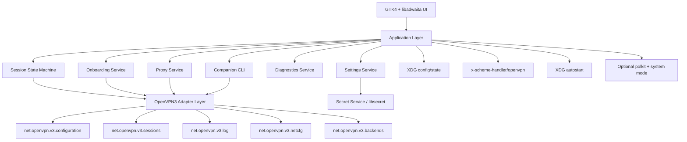

You’re right. Here’s the content directly in chat.

I included citations so the plan stays grounded in the current OpenVPN docs. When you paste into your repo, just delete the citation markers if you want a clean file. OpenVPN 3 Linux is built around multiple D-Bus services that auto-start on demand, and OpenVPN Connect on Windows currently documents profile import, app settings, launch options, proxies, CLI automation, token-URL onboarding, and related admin workflows. ([GitHub][1])

# `plan.md`

# OpenVPN 3 Linux GUI Plan

## Goal

Build a native Linux desktop GUI for OpenVPN 3 Linux that matches OpenVPN Connect on Windows feature-wise as closely as possible, while using Linux-native implementations where Windows-specific behavior does not translate directly.

This app should not be a thin shell wrapper around `openvpn3` commands. The primary integration surface must be OpenVPN 3 Linux D-Bus services. OpenVPN 3 Linux is explicitly designed around D-Bus services such as configuration, sessions, logging, backend startup, and network configuration. ([GitHub][1])

## Product intent

The target is not “make a Linux app that can connect to OpenVPN.”
The target is “make a Linux GUI that feels equivalent to OpenVPN Connect on Windows in day-to-day use.”

That means the Linux app must support the same user-facing capability categories:

* profile import from file
* profile import from URL
* token URL onboarding flows
* profile list management
* connect / disconnect / pause / resume / restart
* credential and challenge prompts
* app settings
* proxy management and per-profile proxy assignment
* startup / launch behavior
* diagnostics and logs
* automation through a companion CLI
* optional capability-gated features like DCO and device posture integration where available. ([OpenVPN][2])

## Recommended stack

Use:

* Python 3
* PyGObject
* GTK4
* libadwaita
* GDBus via Gio
* Secret Service / libsecret for credential storage
* pytest for tests
* native DEB and RPM packaging first

This stack is the shortest path to a native Linux desktop app that integrates cleanly with D-Bus, XDG desktop features, URI handlers, autostart, and packaging.

## Core implementation principles

1. D-Bus is the source of truth.
2. The GUI never talks to raw D-Bus object paths directly.
3. All OpenVPN operations go through an internal adapter layer.
4. Settings and secrets are separate concerns.
5. The UI must be event-driven and state-machine-driven.
6. Shelling out to `openvpn3` is allowed only for diagnostics, environment checks, or emergency fallback tooling.
7. Windows feature parity means matching capability, not blindly cloning Windows UX.

## Scope labels

Every feature must be classified before implementation:

* `parity-direct`: can be implemented directly against OpenVPN 3 Linux D-Bus
* `parity-linux-adapted`: same user value, Linux-native implementation
* `parity-later`: intentionally deferred due to backend, packaging, or platform constraints

This prevents scope confusion and keeps the backlog honest.

## Step-by-step process

### 1. Freeze a feature parity matrix

Create a document called `docs/feature-parity.md`.

List every major OpenVPN Connect Windows capability and mark it as one of:

* supported in v1
* supported with Linux-native behavior
* deferred

Use the current Windows docs as the reference surface. Windows currently documents import from file and URL, launch options, settings like protocol and timeout, global config via `.ocfg`, CLI management, proxy creation and assignment, and service-style behavior. ([OpenVPN][2])

### 2. Build the backend adapter before building polished UI

Create a dedicated internal package for OpenVPN 3 Linux integration.

Suggested internal modules:

* `dbus_client.py`
* `configuration_service.py`
* `session_service.py`
* `log_service.py`
* `attention_service.py`
* `backend_service.py`
* `netcfg_service.py`

This adapter should wrap the OpenVPN 3 Linux service model, which includes configuration, session management, backend startup, log access, and network configuration. ([GitHub][1])

The rest of the app must consume typed Python methods such as:

* `list_profiles()`
* `import_profile_from_file(path)`
* `import_profile_from_bytes(name, data)`
* `import_profile_from_url(url)`
* `delete_profile(profile_id)`
* `create_session(profile_id)`
* `prepare_session(session_id)`
* `connect_session(session_id)`
* `pause_session(session_id)`
* `resume_session(session_id)`
* `restart_session(session_id)`
* `disconnect_session(session_id)`
* `get_session_status(session_id)`
* `subscribe_session_events(session_id)`
* `get_attention_requests(session_id)`
* `provide_user_input(session_id, field_id, value)`
* `read_session_logs(session_id)`

### 3. Implement the session state machine

Do not let UI windows drive connection logic directly.

Create a formal session state machine with states like:

* `idle`
* `profile_selected`
* `session_created`
* `waiting_for_input`
* `ready`
* `connecting`
* `connected`
* `paused`
* `reconnecting`
* `disconnecting`
* `error`

OpenVPN 3 Linux’s flow is D-Bus-oriented: create configuration, create session, prepare it, handle required user input when attention is needed, then connect and monitor status/log changes. ([GitHub][1])

### 4. Build profile onboarding as a first-class subsystem

Implement all onboarding paths as explicit product features, not just helper dialogs.

Required onboarding paths:

* import `.ovpn` from file picker
* drag and drop `.ovpn`
* import from URL
* handle `openvpn://import-profile/...` token URLs
* optional browser-assisted onboarding flow for Access Server / CloudConnexa-like flows

OpenVPN documents both file import and URL import in Connect, and Access Server documents token URLs using the `openvpn://import-profile/` prefix. Manual workflows also explicitly describe stripping that prefix to obtain the underlying HTTPS download URL. ([OpenVPN][2])

Linux implementation notes:

* register `.ovpn` MIME/file association
* register `x-scheme-handler/openvpn`
* support app launch with an import URL argument
* if the token URL cannot be handled directly, transform it into a normal fetch/import path

### 5. Separate app settings from profile settings

Create two models:

* app-level settings
* profile-level settings

App-level settings should include Linux equivalents of the OpenVPN Connect Windows settings surface, including protocol selection, connection timeout, launch options, seamless tunnel behavior, theme, disconnect confirmation, security level, TLS 1.3 enforcement, DCO, IPv6 blocking, Google DNS fallback, and local DNS behavior. ([OpenVPN][3])

Storage rules:

* use XDG config for non-sensitive app settings
* use XDG state for runtime/cache state
* use Secret Service / libsecret for credentials and secrets
* never store secrets in plain JSON or plain-text app config

### 6. Implement credential and challenge handling early

This is a hard requirement for parity.

The app must handle:

* username/password prompts
* private key passphrase prompts
* OTP / MFA / challenge prompts
* retry flows after auth failure
* browser-based handoff where applicable

OpenVPN 3 Linux uses attention/user-input mechanics over D-Bus, so the UX must be driven by event subscriptions and prompt descriptors, not by static forms. ([GitHub][1])

### 7. Build profile management views

The main UI should support:

* list profiles
* search/filter profiles
* show last connection state
* show current assigned proxy
* edit metadata
* delete profile
* duplicate profile metadata without duplicating secrets unless explicitly requested

A profile details view should show:

* display name
* source type
* import time
* last used
* current effective settings
* assigned proxy
* capability flags such as DCO-supported or posture-capable

### 8. Add proxy management as a real subsystem

OpenVPN Connect documents a dedicated proxy model where users can create proxy configs and assign one proxy per profile. ([OpenVPN][4])

Implement:

* saved proxy list
* add/edit/delete proxy configuration
* per-profile proxy assignment
* validation for unsupported or incomplete entries
* secure storage for proxy credentials

Do not hide this inside raw profile editing.

### 9. Map Windows launch behavior to Linux-native startup behavior

OpenVPN Connect documents launch options such as:

* Start app
* Connect latest
* Restore connection
* None ([OpenVPN][5])

On Linux, implement these as:

* XDG autostart entry
* restore-last-profile state
* connect-latest state
* start-minimized behavior if implemented
* optional background indicator mode

This is a `parity-linux-adapted` feature, not a literal clone of Windows startup internals.

### 10. Treat service-style behavior as a separate operating mode

OpenVPN Connect on Windows documents a service daemon mode intended for auto-login style scenarios. ([OpenVPN][6])

For Linux, implement two modes:

* **user mode**: standard desktop app
* **system mode**: optional privileged helper plus polkit plus systemd-managed operations for boot/startup scenarios

System mode rules:

* opt-in only
* clearly separated from user mode
* must document privilege boundaries
* only enable features that make sense for unattended or auto-login profiles

### 11. Add diagnostics and log center

OpenVPN 3 Linux logging is service-based, and the docs note that most log events flow through D-Bus. ([GitHub][7])

The app must provide:

* live session log viewer
* last error view
* connection timeline
* environment health checks
* exportable support bundle

The support bundle should include:

* app version
* distro and version
* desktop environment
* kernel version
* OpenVPN 3 Linux version
* available D-Bus services
* profile metadata excluding secrets
* last N log lines
* current feature toggles

### 12. Add a companion CLI that uses the same application core

OpenVPN Connect documents CLI management for app behavior, profile import, and settings workflows. It also documents `.ocfg` global configuration support. ([OpenVPN][8])

Ship a Linux companion CLI with commands like:

* `ovpn-gui profiles list`
* `ovpn-gui profiles import FILE`
* `ovpn-gui profiles remove PROFILE_ID`
* `ovpn-gui sessions connect PROFILE_ID`
* `ovpn-gui sessions disconnect PROFILE_ID`
* `ovpn-gui settings list`
* `ovpn-gui settings set KEY VALUE`
* `ovpn-gui config import FILE`
* `ovpn-gui doctor`

This CLI is for automation, debugging, smoke tests, and future scripting.

### 13. Add DCO as a capability-gated feature

OpenVPN documents DCO on Linux as a kernel-module-backed performance feature that moves data channel processing into the kernel. ([OpenVPN][9])

Implementation rules:

* detect whether DCO is available
* expose DCO only when supported
* show status clearly per profile/session
* make fallback behavior explicit when unavailable

### 14. Add device posture only when the Linux prerequisites are present

OpenVPN’s Linux posture documentation says additional setup is needed for the OpenVPN 3 Linux client to pass device attributes for CloudConnexa posture checks. CloudConnexa posture policies evaluate device attributes that the client sends at connect time and during sessions. ([OpenVPN][10])

Implementation rules:

* detect whether posture-related Linux add-ons are installed
* expose posture UI only when supported
* show admin-facing diagnostics instead of dead toggles

### 15. Package for native Linux first

Start with:

* Fedora RPM
* Ubuntu/Debian DEB

Do not start with AppImage or Flatpak.

This app needs close integration with:

* system D-Bus
* desktop URI handlers
* autostart
* optional polkit
* optional systemd units

Native packaging is the simplest way to ship those integrations correctly.

## Recommended repository structure

```text
openvpn3-linux-gui/
  README.md
  AGENTS.md
  plan.md
  pyproject.toml
  Makefile
  src/
    app/
      __init__.py
      main.py
      application.py
      windows/
      dialogs/
      widgets/
    core/
      models.py
      events.py
      state_machine.py
      settings.py
      secrets.py
      diagnostics.py
      onboarding.py
      proxies.py
    openvpn3/
      dbus_client.py
      configuration_service.py
      session_service.py
      attention_service.py
      log_service.py
      netcfg_service.py
      backend_service.py
    cli/
      main.py
  docs/
    product-spec.md
    feature-parity.md
    dbus-notes.md
    packaging.md
    security.md
  packaging/
    deb/
    rpm/
    desktop/
    icons/
    uri-handler/
    systemd/
    polkit/
  tests/
    unit/
    integration/
    e2e/
    fixtures/
```

## Architecture

The app should sit on top of the OpenVPN 3 Linux D-Bus service model, not around it. OpenVPN 3 Linux documents a multi-service architecture with auto-started services and clear service separation. ([GitHub][1])



## UI surface to build

### Main window

Must include:

* profile list
* connect/disconnect actions
* current connection banner
* status chips
* search
* quick import action
* quick settings entry
* quick diagnostics entry

### Import flow

Must support:

* file import
* URL import
* token URL handling
* validation
* duplicate detection
* imported profile preview
* save/cancel flow

### Connection flow

Must support:

* progress state
* credential prompts
* MFA/challenge prompts
* error banners
* reconnect state
* pause/resume/restart actions

### Settings

Must expose:

* protocol
* timeout
* launch behavior
* seamless tunnel
* theme
* security level
* TLS 1.3 enforcement
* DCO toggle where supported
* IPv6 blocking
* DNS behavior
* disconnect confirmation. ([OpenVPN][3])

### Proxies

Must expose:

* saved proxies
* add/edit/delete
* assign to profile
* one-proxy-per-profile model. ([OpenVPN][4])

### Diagnostics

Must expose:

* logs
* current service reachability
* environment checks
* support bundle export
* DCO detection
* posture capability detection

## Security rules

* Never log secrets.
* Never store passwords outside libsecret.
* Never keep decrypted secret material in persistent debug files.
* Redact credentials from support bundles.
* Validate all external import URLs.
* Treat token URLs as sensitive onboarding artifacts.
* Keep privileged/system-mode code isolated and minimal.

## Testing strategy

### Unit tests

Cover:

* D-Bus adapter contract
* state machine transitions
* settings validation
* proxy validation
* token URL parsing
* diagnostics redaction

### Integration tests

Cover:

* import profile
* create session
* input prompt handling
* successful connect/disconnect
* proxy assignment flow
* autostart state restoration

### End-to-end tests

Cover:

* file import from desktop UI
* browser/token onboarding
* challenge prompt loop
* restore connection behavior
* diagnostics export

## Acceptance criteria for v1

v1 is done when all of the following are true:

* app installs on Fedora and Ubuntu/Debian through native packages
* app detects OpenVPN 3 Linux availability
* user can import profile from file
* user can import profile from URL
* token URL onboarding is supported
* user can connect, disconnect, pause, resume, and restart sessions
* attention-required prompts work correctly
* app settings cover the major Windows-equivalent controls
* proxy management exists and supports per-profile assignment
* launch behavior works on Linux with native startup mechanisms
* diagnostics and logs are exportable
* a companion CLI exists
* DCO is detected and surfaced when available
* posture support is capability-gated and only shown when supported. ([OpenVPN][2])

## First Codex prompt

Create a Python 3 desktop app skeleton for Linux using PyGObject, GTK4, and libadwaita.

Project goal:
Build a GUI frontend for OpenVPN 3 Linux with feature parity to OpenVPN Connect on Windows, using OpenVPN 3 Linux D-Bus services as the primary backend integration.

Requirements:

* Create a clean repo structure with src/, tests/, docs/, packaging/
* Implement a typed D-Bus adapter layer for:

  * configuration import/list/delete
  * session create/connect/disconnect/pause/resume/restart
  * attention-required / user-input queue handling
  * log access
* Add a session state machine
* Add placeholder GTK windows for:

  * main profile list
  * profile import
  * connect status
  * settings
  * proxy management
  * diagnostics
* Add a companion CLI entrypoint
* Add pytest setup
* Add pyproject.toml
* Add AGENTS.md explaining architecture and coding conventions
* Do not shell out to openvpn3 except in a diagnostics helper
* Keep code modular and production-oriented

## Next Codex prompt

Create `docs/feature-parity.md` and fill it with a parity matrix that maps OpenVPN Connect on Windows features into:

* parity-direct
* parity-linux-adapted
* parity-later

Include categories for:

* profile onboarding
* session lifecycle
* settings
* proxies
* launch behavior
* diagnostics
* CLI automation
* global config import
* DCO
* device posture